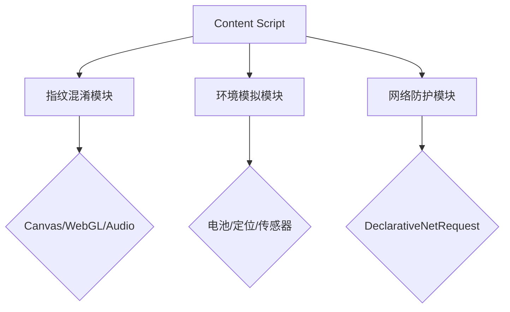

# GPT防降智插件  

[English](README_EN.md) | 简体中文

## ⚠️ 重要说明
这是一个对ChatGPT降智行为的反制插件，其作用在于：
将Web端对ChatGPT的访问进行适当的伪装，防止OpenAI官方对ChatGPT进行降低能力的输出。但不能完全保证反制功能的实现，这取决于：

- 🔍 **账号状态** 是否被官方标记为受限账号
- 🌐 **IP信誉** 是否被判定为污染地址段
- 🛡️ **防护机制** 是否适配最新检测算法

技术实现原理：
- 浏览器指纹混淆（Canvas/WebGL/Audio）
- 设备特征模拟（电池/传感器/网络）
- 隐私保护增强（WebRTC/IP伪装）

## 🛡️ 核心功能
### 环境模拟系统
- **设备指纹混淆**
  - `Canvas指纹`动态噪声注入
  - `WebGL渲染器`特征重写
  - `AudioContext`波形扰动
- **实时环境参数**
  - 动态电池状态模拟（5分钟自动更新）
  - 设备方向传感器伪装（α/β/γ参数动态修正）
  - 网络连接参数动态调整（4G/5G自动切换）

### 隐私保护层
- **WebRTC隐私保护**
  - ICE候选地址过滤
  - SDP协议字段重写
- **Android WebView模拟**
  - 设备型号特征伪装（Pixel系列/三星系列）
  - 系统级API接口注入

## 📦 安装指南
1. 浏览器加载
- 访问 `chrome://extensions`
- 启用「开发者模式」
- 点击「加载已解压的扩展程序」选择项目目录

## 🛠️ 使用说明
### 功能控制
```javascript
// 手动触发环境更新
chrome.storage.local.set({ pluginEnabled: true }, () => {
  console.log('防降智功能已激活');
});

// 获取当前状态
chrome.storage.local.get(['pluginEnabled'], result => {
  console.log('当前状态:', result.pluginEnabled ? '启用' : '禁用');
});
```

### 兼容性配置
| 浏览器特性       | 支持版本       | 降级方案          |
|------------------|----------------|-------------------|
| Declarative Net  | Chrome 88+     | 回退到webRequest  |
| MutationObserver | Level 2        | 定时轮询DOM       |
| Storage API      | IndexedDB v1.0 | localStorage替代 |

## 🔧 技术架构


## ⚠️ 安全警告
```diff
+ 官方认证域名清单：
- chat.openai.com
- *.chatgpt.com
- *.ai.com

! 检测到非常规访问域名时将自动禁用核心功能
```

## 🤝 参与贡献
1. Fork项目仓库
2. 创建特性分支 (`git checkout -b feature/improvement`)
3. 提交修改 (`git commit -m 'Add some feature'`)
4. 推送分支 (`git push origin feature/improvement`)
5. 创建Pull Request

## 许可协议
[](LICENSE)
