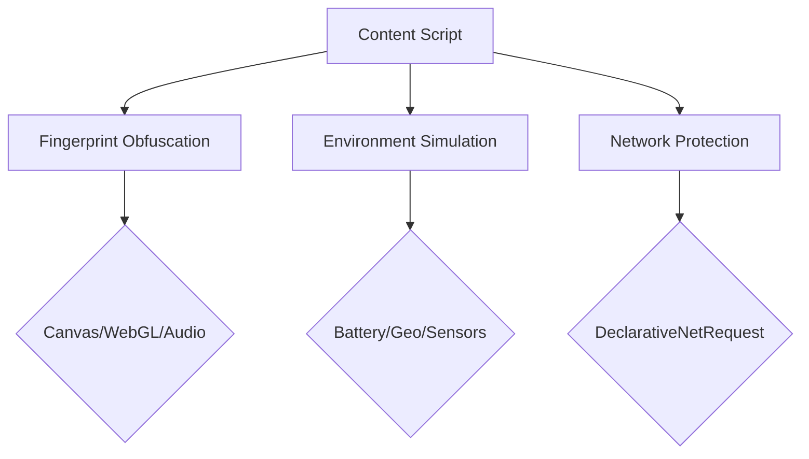

# GPT Anti-Degeneration Plugin  

[简体中文](README.md) | English

## ⚠️ Important Notice
This plugin counters ChatGPT's intelligence reduction by:
Disguising web access to prevent OpenAI from downgrading ChatGPT's capabilities. Full effectiveness depends on:

- 🔍 **Account Status** Whether flagged by OpenAI
- 🌐 **IP Reputation** If marked as restricted range
- 🛠️ **Detection** Compatibility with latest algorithms

Core technical implementations:
- Browser fingerprint masking (Canvas/WebGL/Audio)
- Dynamic device simulation (Battery/Sensors)
- Network environment emulation (IP/WebRTC)

## 🛡️ Core Features
### Environment Simulation System
- **Device Fingerprint Obfuscation**
  - Dynamic noise injection for `Canvas fingerprint`
  - `WebGL renderer` feature rewriting
  - `AudioContext` waveform perturbation
- **Real-time Environment Parameters**
  - Dynamic battery status simulation (5-minute auto-update)
  - Device orientation sensor emulation (α/β/γ dynamic correction)
  - Network parameters dynamic adjustment (4G/5G auto-switching)

### Privacy Protection Layer
- **WebRTC Privacy Protection**
  - ICE candidate address filtering
  - SDP protocol field rewriting
- **Android WebView Emulation**
  - Device model emulation (Pixel/Samsung series)
  - System-level API interface injection

## 📦 Installation Guide
1. Clone repository
```bash
git clone https://github.com/your-repo/anti-gpt-degen.git
```
2. Browser installation
- Visit `chrome://extensions`
- Enable "Developer mode"
- Click "Load unpacked" and select extension directory

## 🛠️ Usage
### Feature Control
```javascript
// Manual environment refresh
chrome.storage.local.set({ pluginEnabled: true }, () => {
  console.log('Anti-degeneration activated');
});

// Get current status
chrome.storage.local.get(['pluginEnabled'], result => {
  console.log('Current status:', result.pluginEnabled ? 'Enabled' : 'Disabled');
});
```

### Compatibility Matrix
| Browser Feature     | Supported Version | Fallback Solution     |
|---------------------|-------------------|-----------------------|
| Declarative Net     | Chrome 88+        | webRequest fallback   |
| MutationObserver    | Level 2           | DOM polling           |
| Storage API         | IndexedDB v1.0    | localStorage fallback |

## 🔧 Technical Architecture


## ⚠️ Security Notice
```diff
+ Official Domain Whitelist:
- chat.openai.com
- *.chatgpt.com
- *.ai.com

! Core features disabled when detecting unofficial domains
```

## 🤝 Contribution
1. Fork the repository
2. Create feature branch (`git checkout -b feature/improvement`)
3. Commit changes (`git commit -m 'Add some feature'`)
4. Push branch (`git push origin feature/improvement`)
5. Create Pull Request

## License
[](LICENSE)
